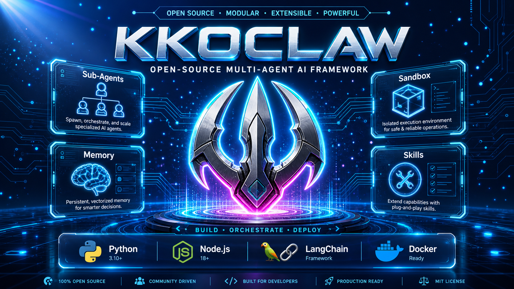

<p align="center">
  <picture>
    <source media="(prefers-color-scheme: dark)" srcset="assets/cover.png">
    
  </picture>
</p>

---

[](./backend/pyproject.toml)
[](./Makefile)
[](./LICENSE)

[English](./README.en.md) | **简体中文**

KKOCLAW 是一个开源的 **super agent harness**。它把 **sub-agents**、**memory** 和 **sandbox** 组织在一起，再配合可扩展的 **skills**，让 agent 可以完成几乎任何事情。

---

## 目录

- [快速开始](#快速开始)
  - [配置](#配置)
  - [运行应用](#运行应用)
    - [部署建议与资源规划](#部署建议与资源规划)
    - [启动服务](#启动服务)
    - [服务管理命令](#服务管理命令)
    - [服务端口](#服务端口)
  - [进阶配置](#进阶配置)
    - [Sandbox 模式](#sandbox-模式)
    - [MCP Server](#mcp-server)
    - [IM 渠道](#im-渠道)
    - [LangSmith 链路追踪](#langsmith-链路追踪)
- [桌面端](#桌面端)
  - [桌面端开发环境搭建](#桌面端开发环境搭建)
  - [桌面端运行命令](#桌面端运行命令)
  - [桌面端特性](#桌面端特性)
  - [桌面端自动更新](#桌面端自动更新)
- [核心特性](#核心特性)
  - [Coding Agent 与 Qiongqi 引擎](#coding-agent-与-qiongqi-引擎)
  - [Skills 与 Tools](#skills-与-tools)
  - [Sub-Agents](#sub-agents)
  - [Sandbox 与文件系统](#sandbox-与文件系统)
  - [Context Engineering](#context-engineering)
  - [长期记忆](#长期记忆)
  - [Token 用量统计](#token-用量统计)
- [项目 TODO](#项目-todo)
  - [今日已完成](#今日已完成)
  - [后续待完成](#后续待完成)
- [推荐模型](#推荐模型)
- [内嵌 Python Client](#内嵌-python-client)
- [文档](#文档)
- [安全使用](#️-安全使用)
- [参与贡献](#参与贡献)
- [许可证](#许可证)

## 快速开始

### 配置

1. **克隆仓库**

   ```bash
   git clone https://github.com/kkutysllb/kk_OClaw
   cd kk_OClaw
   ```

2. **生成本地配置文件**

   在项目根目录执行：

   ```bash
   make config
   ```

   这个命令会基于示例模板生成本地配置文件。

3. **配置你要使用的模型**

   编辑 `config.yaml`，至少定义一个模型：

   ```yaml
   models:
     - name: gpt-4                       # 内部标识
       display_name: GPT-4               # 展示名称
       use: langchain_openai:ChatOpenAI  # LangChain 类路径
       model: gpt-4                      # API 使用的模型标识
       api_key: $OPENAI_API_KEY          # API key（推荐使用环境变量）
       max_tokens: 4096                  # 单次请求最大 tokens
       temperature: 0.7                  # 采样温度
   ```

4. **为已配置的模型设置 API key**

   推荐在项目根目录下的 `.env` 文件中设置：

   ```bash
   TAVILY_API_KEY=your-tavily-api-key
   OPENAI_API_KEY=your-openai-api-key
   ```

### 运行应用

所有部署模式统一通过 `start.sh` 管理，支持三种运行模式：

| 模式 | 命令 | 说明 |
|------|------|------|
| dev | `./start.sh start` | 本地开发，热重载 |
| prod | `start.sh start prod` | 本地生产，预构建前端 |
| docker | `start.sh start docker` | Docker 生产，容器化部署 |

#### 部署建议与资源规划

| 部署场景 | 起步配置 | 推荐配置 | 说明 |
|---------|-----------|------------|-------|
| 本地开发 / `./start.sh start` | 4 vCPU、8 GB 内存、20 GB SSD | 8 vCPU、16 GB 内存 | 适合单个开发者或单个轻量会话 |
| 本地生产 / `./start.sh start prod` | 4 vCPU、8 GB 内存、20 GB SSD | 8 vCPU、16 GB 内存 | 适合稳定运行 |
| Docker 生产 / `./start.sh start docker` | 8 vCPU、16 GB 内存、40 GB SSD | 16 vCPU、32 GB 内存 | 适合共享环境、多 agent 任务 |

- 上面的配置只覆盖 KKOCLAW 本身；本地大模型需单独预留资源。
- 持续运行的服务推荐 Linux + Docker 模式。

#### 启动服务

**首次使用前**，先完成「配置」步骤，然后安装依赖：

```bash
make check    # 校验 Node.js 22+、pnpm、uv、nginx
make install  # 安装 backend + frontend 依赖
```

**本地开发模式**（默认，支持热重载）：

```bash
./start.sh start
```

**Docker 生产模式**（容器化部署，首次启动会自动构建镜像）：

```bash
./start.sh start docker
```

生产部署如果需要提高 Gateway 并发，可在 `.env` 中设置：

```bash
GATEWAY_WORKERS=2
```

该配置同时适用于本地 `prod` 与 Docker `prod`；开发模式因启用热重载，会忽略该参数并保持单 worker。

访问地址：http://localhost:9191（可通过 `.env` 中的 `NGINX_PORT` 自定义）

> **提示**：Docker 模式需要先安装并启动 Docker。`stop`/`status`/`logs` 命令会自动检测当前运行模式（本地或 Docker），无需手动指定。

#### 服务管理命令

```bash
./start.sh start              # 启动所有服务（开发模式，热重载）
./start.sh start docker       # Docker 生产模式启动
./start.sh start prod         # 本地生产模式启动
./start.sh stop               # 停止所有服务（自动检测模式）
./start.sh restart            # 重启所有服务
./start.sh restart docker     # 重启 Docker 服务
./start.sh status             # 查看服务运行状态（自动检测模式）
./start.sh logs               # 查看所有服务日志
./start.sh logs gateway       # 仅查看 Gateway 日志
./start.sh clean              # 清理缓存文件
./start.sh clean build        # 清理构建产物
./start.sh clean all          # 深度清理
```

跳过依赖同步（已安装依赖时更快启动）：

```bash
SKIP_INSTALL=true ./start.sh start
```

#### 服务端口

所有端口通过 `.env` 文件统一配置：

| 服务     | 默认端口 | 环境变量          |
|----------|---------|-------------------|
| Nginx    | 9191    | `NGINX_PORT`      |
| Frontend | 9192    | `FRONTEND_PORT`   |
| Gateway  | 9193    | `GATEWAY_PORT`    |

本地开发和 Docker 模式共享同一套端口配置，切换部署方式时访问地址不变。

Gateway 生产并发数通过 `.env` 中的 `GATEWAY_WORKERS` 控制，默认 `1`。

### 进阶配置

#### Sandbox 模式

KKOCLAW 支持多种 sandbox 执行方式：
- **本地执行**（直接在宿主机上运行 sandbox 代码）
- **Docker 执行**（在隔离的 Docker 容器里运行 sandbox 代码）
- **Docker + Kubernetes 执行**（通过 provisioner 服务在 Kubernetes Pod 中运行 sandbox 代码）

#### MCP Server

KKOCLAW 支持可配置的 MCP Server 和 skills，用来扩展能力。对于 HTTP/SSE MCP Server，还支持 OAuth token 流程。

#### IM 渠道

KKOCLAW 支持从即时通讯应用接收任务。只要配置完成，对应渠道会自动启动，而且都不需要公网 IP。

| 渠道 | 传输方式 | 上手难度 |
|---------|-----------|------------|
| Telegram | Bot API（long-polling） | 简单 |
| Slack | Socket Mode | 中等 |
| Feishu / Lark | WebSocket | 中等 |
| 企业微信 | WebSocket | 中等 |
| 钉钉 | Stream Push（WebSocket） | 中等 |

**`config.yaml` 中的配置示例：**

```yaml
channels:
  langgraph_url: http://localhost:9193/api
  gateway_url: http://localhost:9193

  feishu:
    enabled: true
    app_id: $FEISHU_APP_ID
    app_secret: $FEISHU_APP_SECRET

  wecom:
    enabled: true
    bot_id: $WECOM_BOT_ID
    bot_secret: $WECOM_BOT_SECRET

  slack:
    enabled: true
    bot_token: $SLACK_BOT_TOKEN
    app_token: $SLACK_APP_TOKEN

  telegram:
    enabled: true
    bot_token: $TELEGRAM_BOT_TOKEN

  dingtalk:
    enabled: true
    client_id: $DINGTALK_CLIENT_ID
    client_secret: $DINGTALK_CLIENT_SECRET
```

**命令**

| 命令 | 说明 |
|---------|-------------|
| `/new` | 开启新对话 |
| `/status` | 查看当前 thread 信息 |
| `/models` | 列出可用模型 |
| `/memory` | 查看 memory |
| `/help` | 查看帮助 |

#### LangSmith 链路追踪

在 `.env` 文件中添加以下配置：

```bash
LANGSMITH_TRACING=true
LANGSMITH_ENDPOINT=https://api.smith.langchain.com
LANGSMITH_API_KEY=lsv2_pt_xxxxxxxxxxxxxxxx
LANGSMITH_PROJECT=xxx
```

## 桌面端

KKOCLAW 提供了一个基于 **Electron 33+** 的跨平台桌面客户端（macOS / Linux / Windows），由 `desktop-electron/` 目录承载。

### 两种使用方式

| 方式 | 适用人群 | 说明 |
|------|---------|------|
| **下载安装包**（推荐） | 普通用户 | 从 [Releases](https://github.com/kkutysllb/kk_OClaw/releases) 下载安装包，开箱即用，无需安装 Python / uv / Node.js 等依赖 |
| **源码编译** | 开发者 | 克隆仓库后在本地编译运行，适用于二次开发和调试 |

**下载安装包**方式下，Python 后端（Gateway + 所有依赖）通过 PyInstaller 打包为独立可执行文件（`oclaw-gateway`），嵌入安装包作为 `extraResources` 资源；前端由 `next build --webpack` 静态导出为 `frontend/out/`，打包时一并嵌入。用户下载安装即可使用，Docker 仅在使用代码沙箱功能时可选安装。

桌面客户端启动时会自动拉起嵌入式后端服务（Gateway，默认端口 `19987`），关闭窗口时自动最小化到系统托盘，点击托盘图标即可恢复。

### 桌面端开发环境搭建（源码编译）

> 以下内容仅适用于需要从源码编译的开发者。普通用户请直接下载安装包。

桌面端在 Web 端依赖（Node.js 22+、pnpm、Python 3.12+、uv）的基础上，还需要 **Electron** 和 **electron-builder**（桌面端根目录的 `devDependencies` 中已声明，`pnpm install` 时自动安装）。

```bash
# 一次性安装所有依赖（根目录 + frontend + desktop-electron + backend）
make install
```

或单独安装桌面端：

```bash
cd desktop-electron
pnpm install --frozen-lockfile
```

| 依赖 | 版本要求 | 说明 |
|------|---------|------|
| Node.js | 22+ | Electron 与前端构建运行时 |
| pnpm | latest | Node 包管理 |
| Python | 3.12+ | 后端运行时 |
| uv | latest | Python 包管理 |
| Electron | 33.x | 由 `desktop-electron/package.json` 管理，pnpm 安装时自动拉取 |
| electron-builder | 25.x | 桌面端打包工具，pnpm 安装时自动拉取 |

> Linux 用户无需安装 `libwebkit2gtk` 等系统依赖，Electron 自带 Chromium 运行时；只需保证系统能运行 Electron 即可。

### 桌面端运行命令

```bash
cd desktop-electron

# 一键开发模式（同时拉起后端 Gateway + Next.js 开发服务器 + Electron 主进程）
pnpm run dev

# 生产构建（TS 编译 + PyInstaller 打包 Gateway + 前端静态导出 + electron-builder 打包 DMG/NSIS/deb/rpm）
pnpm run build:app

# 仅构建前端静态导出（Next.js → frontend/out/）
pnpm --dir ../frontend run build:desktop

# 仅打包 Python Gateway（PyInstaller 输出到 desktop-electron/resources/gateway/）
pnpm run build:gateway
```

开发模式（`pnpm run dev`）会按以下顺序拉起三个进程并通过 `desktop-electron/scripts/dev.mjs` 统一管理：

1. **Python Gateway**：`uv run uvicorn`（`backend/` venv，默认端口 `19987`）
2. **Next.js 开发服务器**：端口 `18659`
3. **Electron 主进程**：通过 `OCLAW_DEV_SERVER=1` 连接开发服务器

### 桌面端特性

| 特性 | 说明 |
|------|------|
| 嵌入式后端 | Python 后端通过 PyInstaller 打包为 `oclaw-gateway` 独立可执行文件，嵌入安装包，开箱即用无需外部依赖 |
| 后端自启 | 应用启动时自动拉起嵌入式 Gateway（IPC `start_backend`），无需手动 `start.sh` |
| 后端热重启 | 通过「应用并重启」按钮或 IPC `restart_backend` 主动重启 Gateway |
| 系统托盘 | 关闭窗口时最小化到托盘，托盘菜单支持查看后端状态、重启后端、退出 |
| 全局快捷键 | `Cmd/Ctrl + Shift + O` 快速显示/隐藏主窗口 |
| 原生文件拖拽 | 支持从系统拖拽文件到聊天窗口直接上传（preload 暴露 `window.oclawDesktop`） |
| 自定义协议 | 主进程注册 `app://` 协议，所有静态资源走 `frontend-protocol.ts`，避免 `file://` 与 ChunkLoad 路径问题 |
| 中文菜单栏 | macOS 原生菜单栏完全中文化（关于/编辑/视图/窗口/帮助） |
| 自适应图标 | 跟随系统主题的八角形 O-Claw 图标 |

### 桌面端自动更新

桌面客户端内置了基于 **GitHub Releases** 的自动更新功能（`electron-updater`）：

- 应用启动 5 秒后自动检查新版本
- 发现新版本时弹出更新对话框，点击「立即更新」自动下载安装
- 更新包通过 `electron-updater` 校验发布工件签名，确保安全性

发布新版本时，维护者只需打一个 Git tag 即可触发 GitHub Actions 自动构建安装包。CI 会先通过 PyInstaller 打包 Python 后端，再用 electron-builder 生成 macOS (arm64)、Linux (deb / rpm)、Windows (NSIS) 安装包并上传到 Release：

```bash
# 更新 desktop-electron/package.json 中的 version
git tag v0.x.0
git push origin main --tags
```

用户端会自动收到更新推送。

## 核心特性

### Coding Agent 与 Qiongqi 引擎

Coding Agent 是 KKOCLAW 面向真实代码项目的独立工程工作台。它通过独立的 **QiongqiEngine** 运行边界，把代码任务和普通聊天、研究、报告等任务隔离开来。

核心特色：

- **独立运行边界**：Coding session、active skills、tool policy、events、ROI 和 change summary 都保存在 `~/.oclaw-coding/{thread_id}`，不会混入普通 OClaw 任务记忆。
- **安全 scratch workspace**：Agent 分析代码时产生的中间文件统一写入 `~/.oclaw-coding/{thread_id}/workspace`，避免污染用户项目根目录。
- **内置工程技能体系**：内置 59 个 Coding skills，覆盖需求分析、技术设计、项目初始化、实现、测试、调试、安全审查、PR review、部署交付等工程流程。
- **项目变更可审计**：前端工作台展示项目文件、代码、任务变更、Git diff、Qiongqi events、ROI 和 review 结论，让用户能看到 agent 本轮到底改了什么。
- **真实 Code Review 工作流**：Code Review 基于项目 diff、任务变更、Qiongqi 事件和本地 PR 上下文，支持 review finding 聚焦到 diff，并提供保守的一键修复能力。
- **不中断任务的前端工作台**：右侧 Agent 对话面板持久挂载，切换 Session、ROI、事件、流程、Skills 等面板不会中断当前 Coding 任务。

详细实现见 [Coding Agent 实现说明](docs/CODING_AGENT.md)。

### Skills 与 Tools

Skills 是 KKOCLAW 能做"几乎任何事"的关键。

标准的 Agent Skill 是一种结构化能力模块，通常就是一个 Markdown 文件，里面定义了工作流、最佳实践，以及相关的参考资源。KKOCLAW 自带一批内置 skills，覆盖研究、报告生成、演示文稿制作、网页生成、图像和视频生成等场景。真正有意思的地方在于它的扩展性：你可以加自己的 skills，替换内置 skills，或者把多个 skills 组合成复合工作流。

Skills 采用按需渐进加载，不会一次性把所有内容都塞进上下文。只有任务确实需要时才加载。

Tools 也是同样的思路。KKOCLAW 自带一组核心工具：网页搜索、网页抓取、文件操作、bash 执行；同时也支持通过 MCP Server 和 Python 函数扩展自定义工具。

```text
# sandbox 容器内的路径
/mnt/skills/public
├── research/SKILL.md
├── report-generation/SKILL.md
├── slide-creation/SKILL.md
├── web-page/SKILL.md
└── image-generation/SKILL.md

/mnt/skills/custom
└── your-custom-skill/SKILL.md      ← 你的 skill
```

### Sub-Agents

复杂任务通常不可能一次完成，KKOCLAW 会先拆解，再执行。

lead agent 可以按需动态拉起 sub-agents。每个 sub-agent 都有自己独立的上下文、工具和终止条件。只要条件允许，它们就会并行运行，返回结构化结果，最后再由 lead agent 汇总成一份完整输出。

这也是 KKOCLAW 能处理从几分钟到几小时任务的原因。比如一个研究任务，可以拆成十几个 sub-agents，分别探索不同方向，最后合并成一份报告，或者一个网站，或者一套带生成视觉内容的演示文稿。

### Sandbox 与文件系统

KKOCLAW 不只是"会说它能做"，它是真的有一台自己的"电脑"。

每个任务都运行在隔离的 Docker 容器里，里面有完整的文件系统，包括 skills、workspace、uploads、outputs。agent 可以读写和编辑文件，可以执行 bash 命令和代码，也可以查看图片。整个过程都在 sandbox 内完成，可审计、会隔离。

```text
# sandbox 容器内的路径
/mnt/user-data/
├── uploads/          ← 你的文件
├── workspace/        ← agents 的工作目录
└── outputs/          ← 最终交付物
```

### Context Engineering

**隔离的 Sub-Agent Context**：每个 sub-agent 都在自己独立的上下文里运行。它看不到主 agent 的上下文，也看不到其他 sub-agents 的上下文。

**摘要压缩**：在单个 session 内，KKOCLAW 会比较积极地管理上下文，包括总结已完成的子任务、把中间结果转存到文件系统、压缩暂时不重要的信息。

### 长期记忆

大多数 agents 会在对话结束后把一切都忘掉，KKOCLAW 不一样。

跨 session 使用时，KKOCLAW 会逐步积累关于你的持久 memory，包括你的个人偏好、知识背景，以及长期沉淀下来的工作习惯。你用得越多，它越了解你的写作风格、技术栈和重复出现的工作流。memory 保存在本地，控制权也始终在你手里。

### Token 用量统计

KKOCLAW 内置了 Token 用量统计功能，帮你追踪和可视化每次 LLM 调用的 token 消耗。

**启用方式**：在 `config.yaml` 中设置：

```yaml
token_usage:
  enabled: true
```

启用后，KKOCLAW 会在每次模型调用后自动记录 input/output/total tokens，并在设置页面的「Token 用量」标签下展示以下内容：

- **总览卡片**：总 Token 用量、总运行次数、配置模型数
- **按模型分布**：每个模型的 API 调用次数、Token 用量，以及按日期的趋势图表（面积图 + 柱状图）
- **按调用方统计**：区分 Lead Agent、Sub-Agent、Middleware 三类调用方各自的 Token 消耗占比

统计数据按登录用户隔离——每个用户只能看到自己的用量。历史数据中模型名缺失的记录会在启动时自动回填为默认模型名。

## 项目 TODO

此处记录最近完成的工作和近期待办，详细清单见 `docs/TODO.md`。

### 今日已完成
- **核心机制体验优化 + DeepSeek thinking mode 修复（2026-06-20）**
  - **任务调度**：`SubagentLimitMiddleware` 超出并发上限的 task 调用不再静默丢弃，新增 `subagent_limit_truncated` SSE 事件通知前端显示 toast 警告，用户可明确感知被跳过的任务。
  - **子任务结果中文化**：`task_tool` 返回给 LLM 和前端的所有状态消息（成功/失败/超时/取消/轮询超时）全部中文化；新增 `task_failed`/`task_timed_out`/`task_cancelled` 事件的前端处理，显示对应 toast 错误提示。
  - **工具错误中文化**：`ToolErrorHandlingMiddleware` 不可恢复错误和可恢复错误的 ToolMessage content 全部中文化，统一整个工具链路的中文体验。
  - **路径授权体验优化**：`path_authorization_required` SSE 事件增加 `timeout_seconds` 字段，前端 toast 显示「请在 N 分钟内完成操作，超时将自动拒绝」，用户清楚知道等待边界。
  - **前端工程化**：将 `onCustomEvent` 中的事件分发逻辑提取为纯函数模块 `stream-event-handler.ts`，依赖注入可测试；新增 21 个单元测试覆盖全部事件类型。
  - **修复 DeepSeek thinking mode 400 错误**：DeepSeek API 在 thinking mode 启用时要求每条 assistant 消息都必须携带 `reasoning_content` 字段。新增 `ensure_reasoning_content` 函数，在 `_get_request_payload` 末尾为缺失该字段的 assistant 消息补充空字符串默认值，根除 pro 模式下多轮对话报错 `The reasoning_content in the thinking mode must be passed back to the API.` 的问题。
- **修复桌面端自动更新 + 新增手动检查更新菜单（2026-06-20）**
  - **修复自动更新从未生效的根因**：`UpdateChecker` 组件定义完整但从未被任何 layout 渲染，导致启动后 5 秒的自动检查从未执行。在全局 `DesktopProviders` 中挂载 `<UpdateChecker />`，组件内部有 `isDesktop()` 守卫，Web 端不执行。
  - **新增「帮助 → 检查更新…」菜单项**：通过 main→preload→renderer IPC 链路（`menu:check-update` 事件）触发手动检查，区别于启动后的静默检查，手动检查会显示「正在检查…」→「发现新版本」/「已是最新版本」的完整反馈流程。
  - 菜单项向当前聚焦窗口（或最近活跃窗口）发送 IPC 事件，`onCheckUpdateRequest` 返回取消订阅函数确保多窗口场景安全。
  - **注意**：本机已安装的 v0.1.0 / v0.1.1 均无法自动更新（同样缺 UpdateChecker 挂载），需手动下载 v0.1.2 dmg 安装一次，之后自动更新将正常工作。
- **移除工具循环检测机制 + 死代码清理（2026-06-20）**
  - **完全移除 `LoopDetectionMiddleware`** 的 3 处注入点（factory.py、lead_agent/agent.py、subagents/executor.py），并彻底清理相关死代码：删除 `loop_detection_middleware.py`、`loop_detection_config.py`、`test_loop_detection_middleware.py`（含桌面端打包镜像文件）。
  - 原因：4 层循环检测机制（哈希检测 / 频率检测 / 错误收敛 / Storm Breaker）阈值与实际长流程任务冲突，导致任务执行半途中被自动中断，客户体验不佳。移除后，Storm Breaker（同回合重复调用抑制）仍由 `TokenEconomyMiddleware` 提供保护。
  - 清理 `AppConfig.loop_detection` 死字段（该字段此前从未被任何代码消费，且 config 默认值 30/50 与代码默认值 80/150 不一致）。
  - 任务中断的 SSE `task_interrupted` 通知机制予以保留，服务于 `SafetyFinishReasonMiddleware` 等其他中断源。
  - 中英文文档（middlewares.mdx）同步更新中间件列表与说明。
- **桌面端 Web 数据迁移向导 + 多处稳定性修复（2026-06-19）**
  - 新增 **Web 端数据迁移向导**：桌面端安装后可从已部署的 Web 端项目一键迁移自定义技能、扩展配置（MCP servers + 技能开关）、技能凭证（.env）、记忆数据和自定义 Agent，避免重新配置。Web 端的公共技能迁移到桌面端后变为用户的私有副本，可自由修改而不影响 Web 端其他用户。
  - 迁移逻辑正确适配 Web 端**分散布局**（skills/custom、.env、extensions_config.json、backend/.kkoclaw/）与桌面端**扁平布局**（~/.kkoclaw-desktop/）的差异，各类别采用不同的合并策略：技能/agent 跳过已存在项、扩展配置 JSON 并联合并、凭证只追加缺失的 KEY、记忆仅当目标不存在时复制。
  - 首次启动自动检测 Web 端项目并弹窗提示（`.migration_prompted` sentinel 防重复），也可从设置面板 → 数据导入手动触发。4 步向导 UI：选择来源 → 选择内容 → 预览确认 → 执行迁移。
  - **修复 VllmChatModel 字段错误**：Pydantic 模型不允许 `setattr` 未声明字段，改为在类中显式声明 `reasoning_effort_values: list[str] | None = None`，factory.py 的 except 子句增加 `ValueError` 捕获。
  - **修复 coding_agent 名称验证失败**：`AGENT_NAME_PATTERN` 原先不允许下划线导致内置 `coding_agent` 被拒绝，正则改为 `^[A-Za-z0-9_-]+$`。
  - **修复标签切换导致 coding agent 任务中断**：`threadId` 从纯 `useState` 改为通过 localStorage（key: `coding:thread:${projectId}`）持久化，标签切换后可重连原任务。
- **coding agent功能完成+前端多标签功能实现（2026-06-18）**
  - 完成Coding Agent 面向真实代码项目的独立工程工作台。它通过独立的 **QiongqiEngine（穷奇）** 运行边界，把代码任务和普通聊天、研究、报告等任务隔离开来。
  - 完成前端多标签功能，实现在一个页面内容多任务并行。web端和桌面端同步实现。
  - 修改视频生成技能的模型调用，优选可灵，次选gemini，支持文生视频和图生视频。支持官方和中转。TTS(speech-2.8-hd)/音乐(music-2.6) 保留 MiniMax，仅替换视频生成模型
- **Token Economy 系统性设计移植（2026-06-13）**
  - 实现 5 层 Token 经济机制，系统性降低 token 消耗，默认全部禁用，显式开启
  - 新增 `TokenEconomyConfig` 配置模型（`token_economy_config.py`），支持简洁响应指令、历史工具结果压缩、Storm Breaker 三层开关
  - 新增 `TokenEconomyMiddleware`（`token_economy_middleware.py`）：模型调用前自动截断旧 ToolMessage 内容（head+tail 策略），保护代码块/URL/文件路径/错误信号不被破坏；注入简洁响应 system-reminder
  - 新增 `ToolStormBreaker`（`tool_storm_breaker.py`）：滑动窗口跟踪同回合工具调用，相同 name+args 达到阈值后自动抑制；变更类工具自动清除只读记录
  - 新增 `prefix_volatility.py` 诊断模块：扫描 system prompt 中的 UUID/ISO8601/十六进制哈希/JWT 等易变 token，用于定位 prompt cache 失效原因
  - `TokenEconomyMiddleware` 集成 Storm Breaker：在 `wrap_tool_call` 入口拦截同回合重复调用，返回解释性 ToolMessage 而非执行实际工具
  - `AppConfig` 注册 `token_economy` 字段，`agent.py` 中间件链在 `ToolOutputBudgetMiddleware` 之后注册 `TokenEconomyMiddleware`
  - 配置同步：`config.yaml`、`config.example.yaml`、`desktop/backend-build/config.embedded.yaml` 三端配置文件均添加 `token_economy` 段
  - 完整单元测试覆盖（`test_token_economy_middleware.py`，26 个测试用例）：历史截断、保护段、信号行、简洁指令、Storm Breaker 抑制/变更清除/turn 重置/参数顺序无关性、易变 token 检测
- **配置面板与模型管理重构（2026-06-13）**
  - 新增统一配置面板：`config-settings-page.tsx` 可视化编辑 `config.yaml` 所有顶层配置项，替代手动编辑 YAML
  - 后端新增通用配置 CRUD API：`routers/config.py` 提供 `GET/PUT /api/config`（全量）和 `GET/PUT /api/config/{section}`（分区段）接口，敏感字段（api_key/secret/token）读取时自动脱敏
  - 模型管理整合到配置面板：删除独立的模型管理页面，模型列表 CRUD 统一在配置面板的「模型」标签页内完成
  - 10 个分区表单组件：日志级别、Token 用量、Sandbox、标题生成、摘要压缩、记忆、数据库、运行事件、定时任务、文件上传，均支持独立保存并显示后端返回的具体错误信息
  - YAML 原始编辑器：支持直接编辑 `config.yaml` 原始内容，适合高级用户批量修改
  - **统一「应用并重启」按钮**：配置保存后点击按钮即可重启后端使配置生效，桌面端通过 Electron preload 暴露的 IPC `restart_backend`（`window.oclawDesktop`）管理，Web 端通过 `POST /api/config/restart`（detached watcher + `os._exit(0)` 自重启）+ 健康轮询实现
  - **修复表单保存错误提示**：所有表单 catch 块改为显示 `e.message` 而非通用的「保存失败」，方便定位问题
- **相关模块全面增强（2026-05-29）**
  - 用户隔离：`paths.py` + `agents_config.py` 新增 per-user agent 目录，兼容 legacy 共享布局
  - 路由同步：`agents.py`/`threads.py`/`runs.py`/`uploads.py`/`artifacts.py`/`auth.py`/`mcp.py` 全面对齐上游
  - 消息转换：`services.py` 使用 `convert_to_messages` 保留 attachments + `inject_authenticated_user_context` + model 验证
  - 安全增强：ZIP 炸弹防护、Origin 验证防 CSRF、MCP 密钥脱敏重构
  - 启动恢复：`deps.py` 自动恢复 Gateway 重启后的孤立运行
- 修复智谱 GLM-5 模型 1210 错误：创建 `PatchedChatZhipu` 适配器剥离不兼容的 `stream_options` 参数
- 任务中断前端提示：安全中间件（如 `SafetyFinishReasonMiddleware`）触发硬停时通过 SSE custom 事件通知前端，前端以 toast 展示中断原因和「继续」操作指引
- `PatchedChatDeepSeek` 增加模型名别名映射机制（`_MODEL_NAME_ALIASES`），支持本地部署模型名（如 `deepseek_v4`）自动映射为 API 接受的名称（如 `deepseek-v4-flash`）
- 完成基于 `current_context` 的 TF-IDF 相似度检索与 memory facts 加权排序
- 为 memory retrieval 增加 facts 侧缓存、可查询统计与调试日志
- 增强 `tokenize_text()` 的中文与技术词切分能力
- 增加可配置的 subagent 父模型到子模型路由能力，支持候选模型与回退策略配置
- 支持将 `.kkoclaw/agents` 下的自定义 agent 直接桥接为可由 `task` 调度的 subagent
- subagent recursion_limit 公式可配置化（`recursion_limit_multiplier` × max_turns + `recursion_limit_base`），默认 `3*max_turns+20`
- 支持通过 `GATEWAY_WORKERS` 配置生产部署的 Gateway 并发数，缓解长任务期间的页面 503/504
- 修复 `MemoryMiddleware` 的 `runtime` 注入问题，并补充异步回归测试
- **Token 用量页面图表增强**：X 轴日期刻度智能倾斜+分级间隔避免重叠；API 调用次数图表升级为双纵轴面积图（左轴 API 调用 + 右轴任务完成次数）
- **Token 追踪精度提升**：RunJournal 引入去重机制（`_counted_llm_run_ids` 等），防止 LangChain callback 重复触发导致 token 重复计数；`record_external_llm_usage_records` 替代旧接口，基于 `source_run_id` 按调用粒度去重
- **运行进度持久化**：新增 `update_run_progress` + Progress Reporter 节流机制，长时间运行期间定期保存 token 快照，避免数据丢失
- **RunManager 可靠性增强**：引入 `PersistenceRetryPolicy` 对 SQLite 写入瞬态错误进行有界重试；`reconcile_orphaned_inflight_runs` 在网关重启后自动恢复孤立的 pending/running 记录
- **新增安全中间件**：`SafetyFinishReasonMiddleware` 检测 LLM 返回的 `stop_reason=SAFETY` 并自动终止运行，防止不安全内容泄露
- **新增动态上下文中间件**：`DynamicContextMiddleware` 在运行时根据配置动态注入上下文信息
- **新增工具输出预算中间件**：`ToolOutputBudgetMiddleware` 限制工具返回内容长度，防止超大输出挤占上下文窗口
- **MCP 会话池化**：新增 `session_pool` 模块，stdio MCP 工具按 `(server_name, thread_id)` 复用持久会话，保障有状态服务器（如 Playwright）的连续性
- **Sub-Agent token 收集器**：新增 `token_collector` 模块，集中采集 sub-agent 的 token 使用记录并上报至 RunJournal
- **技能权限系统**：新增 `permissions.py` + `tool_policy.py`，支持 SKILL.md 中声明所需权限，加载时自动校验
- **`RunRepository` SQL 实现完善**：补全 `update_model_name`、`list_inflight`、`update_run_progress` 方法，`put` 改为 upsert 模式（重试安全），`aggregate_tokens_by_thread` 支持 `include_active` 参数
- **Langfuse 追踪集成**：新增 `tracing/metadata.py`，构建 Langfuse trace-attribute metadata 并注入 RunnableConfig

### 后续待完成

- 池化 sandbox 资源以减少 sandbox 容器数量
- 添加认证 / 授权层
- 实现速率限制
- 添加指标和监控
- 支持更多上传文档格式
- 优化 IM 渠道多任务场景下 agent 热路径的异步并发

## 推荐模型

KKOCLAW 对模型没有强绑定，只要实现了 OpenAI 兼容 API 的 LLM，理论上都可以接入。不过在下面这些能力上表现更强的模型，通常会更适合 KKOCLAW：

- **长上下文窗口**（100k+ tokens），适合深度研究和多步骤任务
- **推理能力**，适合自适应规划和复杂拆解
- **多模态输入**，适合理解图片和视频
- **稳定的 tool use 能力**，适合可靠的函数调用和结构化输出

## 内嵌 Python Client

KKOCLAW 也可以作为内嵌的 Python 库使用，不必启动完整的 HTTP 服务：

```python
from kkoclaw.client import KKOCLAWClient

client = KKOCLAWClient()

# Chat
response = client.chat("分析这篇论文", thread_id="my-thread")

# Streaming（LangGraph SSE 协议）
for event in client.stream("你好"):
    if event.type == "messages-tuple" and event.data.get("type") == "ai":
        print(event.data["content"])

# 配置与管理
models = client.list_models()
skills = client.list_skills()
client.update_skill("web-search", enabled=True)
client.upload_files("thread-1", ["./report.pdf"])
```

## 文档

- [贡献指南](CONTRIBUTING.md) - 开发环境搭建与协作流程
- [Coding Agent 实现说明](docs/CODING_AGENT.md) - Qiongqi 引擎、隔离运行时、前端工作台、diff/review/ROI 工作流
- [项目说明](backend/docs/项目说明.md) - 完整项目文档
- [后端架构](backend/README.md) - 后端架构与 API 参考
- [桌面端发布流程](docs/DESKTOP_RELEASE.md) - electron-builder + Apple 签名 + 公证 + GitHub Actions 矩阵发布全流程

## 安全使用

### 不恰当的部署可能导致安全风险

KKOCLAW 具备**系统指令执行、资源操作、业务逻辑调用**等关键高权限能力，默认设计为**部署在本地可信环境（仅本机 127.0.0.1 回环访问）**。若将 agent 部署至不可信局域网、公网云服务器等环境，且未采取严格的安全防护措施，可能导致安全风险。

### 安全使用建议

建议将 KKOCLAW 部署在本地可信的网络环境下。若您有跨设备、跨网络的部署需求，必须加入严格的安全措施：

- **设置访问 IP 白名单**：使用 iptables 或硬件防火墙配置 IP 白名单
- **前置身份验证**：配置反向代理（nginx 等），开启高强度的前置身份验证
- **网络隔离**：将 agent 和可信设备划分到同一个专用 VLAN
- **持续关注项目更新**：持续关注 KKOCLAW 项目的安全功能更新

## 参与贡献

欢迎参与贡献。开发环境、工作流和相关规范见 [CONTRIBUTING.md](CONTRIBUTING.md)。

## 致谢

OClaw 的诞生离不开以下开源项目的设计灵感与技术基础，在此致以诚挚感谢：

- **[Kun](https://github.com/KunAgent/Kun)** — Token Economy 系统性设计（Immutable Prefix 诊断、Prefix Volatility Detection、历史工具结果压缩、Tool Catalog Fingerprint、Tool Storm Breaker），为 OClaw 的 token ROI 优化提供了完整的架构参考。本项目的 `TokenEconomyMiddleware`、`ToolStormBreaker`、`prefix_volatility` 模块均移植自 Kun 的实现。
- **[LangChain](https://github.com/langchain-ai/langchain)** / **[LangGraph](https://github.com/langchain-ai/langgraph)** — Agent 中间件框架、状态图执行引擎，构成了 OClaw Agent 层的核心基座。
- **[DeerFlow](https://github.com/bytedance/deerflow)** — `SafetyFinishReasonMiddleware` 的设计灵感与 Summarization 触发策略参考。
- **[Claude Code](https://docs.anthropic.com/en/docs/agents-and-tools/claude-code)** — Skill 文件保留策略（`preserve_recent_skill_count`）与配置面板交互设计的灵感来源。

感谢所有为开源社区贡献力量的开发者们。

## 许可证

本项目采用 [MIT License](./LICENSE) 开源发布。
