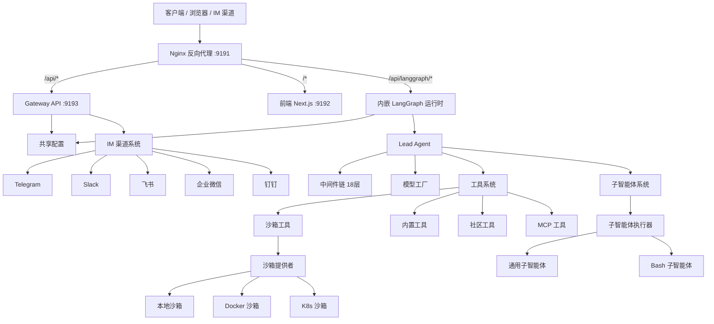

# KKOCLAW 项目说明

## 项目概述

KKOCLAW 是一个开源的超级智能体运行时（Super Agent Harness），基于 LangGraph 和 LangChain 构建。它将子智能体（Sub-Agents）、长期记忆（Memory）和沙箱执行环境（Sandbox）整合在一起，配合可扩展的技能系统（Skills），使智能体能够完成复杂、多步骤的任务。

**核心定位**：一个开箱即用、高度可扩展的智能体运行时平台，让 AI 智能体真正拥有执行能力。

---

## 系统架构



---

## 核心模块详解

### 1. Lead Agent（主智能体）

Lead Agent 是整个系统的运行时入口，通过 `make_lead_agent(config)` 工厂函数创建。它整合了以下能力：

- **动态模型选择**：支持思考模式（thinking）和视觉（vision）能力的按需加载
- **中间件链**：18 层中间件按严格顺序处理横切关注点
- **工具系统**：沙箱工具、MCP 工具、社区工具和内置工具的统一调度
- **子智能体委派**：并行任务执行与结果合并
- **系统提示词**：注入技能指令、记忆上下文和工作目录指导

### 2. 中间件链（Middleware Chain）

中间件按严格顺序执行，每个中间件处理特定的横切关注点：

| 序号 | 中间件名称 | 功能说明 |
|------|-----------|----------|
| 1 | ThreadDataMiddleware | 为每个线程创建隔离目录（workspace/uploads/outputs） |
| 2 | UploadsMiddleware | 将新上传的文件注入会话上下文 |
| 3 | SandboxMiddleware | 获取沙箱执行环境 |
| 4 | DanglingToolCallMiddleware | 修复因用户中断导致的悬空工具调用 |
| 5 | LLMErrorHandlingMiddleware | 将 LLM 调用错误标准化为可恢复错误 |
| 6 | GuardrailMiddleware | 工具调用前的安全授权检查（可选） |
| 7 | SandboxAuditMiddleware | Shell/文件操作的安全审计日志 |
| 8 | ToolErrorHandlingMiddleware | 将工具执行异常转换为错误消息 |
| 9 | SummarizationMiddleware | 上下文 Token 超限时自动压缩（可选） |
| 10 | TodoListMiddleware | Plan Mode 下的多步骤任务追踪（可选） |
| 11 | TokenUsageMiddleware | Token 用量统计（可选） |
| 12 | TitleMiddleware | 自动生成对话标题 |
| 13 | MemoryMiddleware | 异步记忆提取与队列更新 |
| 14 | ViewImageMiddleware | 为视觉模型注入 Base64 图片数据（条件启用） |
| 15 | DeferredToolFilterMiddleware | 延迟工具加载以减少上下文占用（可选） |
| 16 | SubagentLimitMiddleware | 限制并发子智能体数量（可选） |
| 17 | LoopDetectionMiddleware | 检测重复工具调用循环并强制终止 |
| 18 | ClarificationMiddleware | 拦截澄清请求并中断执行（必须为最后） |

### 3. 沙箱系统（Sandbox System）

每个任务运行在隔离的执行环境中，拥有完整的文件系统视图。

**抽象接口**：
- `SandboxProvider`：生命周期管理（`acquire` / `get` / `release`）
- `Sandbox`：文件操作接口（`execute_command` / `read_file` / `write_file` / `list_dir`）

**三种执行模式**：

| 模式 | 提供者 | 说明 |
|------|--------|------|
| 本地执行 | LocalSandboxProvider | 直接在宿主机执行，适合开发环境 |
| Docker 执行 | AioSandboxProvider | 隔离容器执行，适合生产环境 |
| K8s 执行 | AioSandboxProvider + Provisioner | Kubernetes Pod 级隔离，适合多租户 |

**虚拟路径映射**：

| 虚拟路径 | 物理路径 |
|----------|----------|
| `/mnt/user-data/workspace` | `{data_dir}/users/{user_id}/threads/{thread_id}/user-data/workspace` |
| `/mnt/user-data/uploads` | `{data_dir}/users/{user_id}/threads/{thread_id}/user-data/uploads` |
| `/mnt/user-data/outputs` | `{data_dir}/users/{user_id}/threads/{thread_id}/user-data/outputs` |
| `/mnt/skills` | `skills/` 目录 |

**沙箱工具集**：
- `bash`：执行 Shell 命令（支持路径翻译和错误处理）
- `ls`：目录列表（树形格式，最大 2 层）
- `read_file`：读取文件内容（支持行范围）
- `write_file`：写入/追加文件
- `str_replace`：字符串替换（单次或全局）
- `glob`：文件模式匹配搜索
- `grep`：文件内容正则搜索

### 4. 子智能体系统（Subagent System）

Lead Agent 可以动态拉起并行子智能体，每个子智能体拥有独立的上下文、工具和终止条件。

**内置子智能体**：
- `general-purpose`：全工具集（除 `task` 工具外的所有工具）
- `bash`：命令执行专家（仅在 Shell 可用时暴露）

**执行架构**：
- 双线程池调度：调度池 3 worker + 执行池 3 worker
- 最大并发数：3 个子智能体
- 超时时间：默认 15 分钟（可配置）
- SSE 事件流：`task_started → task_running → task_completed / task_failed / task_timed_out`

**自定义子智能体**：支持通过配置文件定义专用子智能体，可自定义提示词、工具白名单、技能白名单和独立模型。

### 5. 记忆系统（Memory System）

LLM 驱动的跨会话持久化记忆，自动提取用户偏好、知识背景和工作习惯。

**数据结构**：
- **用户上下文**：工作上下文、个人上下文、当前关注事项
- **历史记录**：近期数月、早期上下文、长期背景
- **事实库**：离散事实，带置信度评分（0-1）、来源和分类

**工作流程**：
1. MemoryMiddleware 过滤消息（用户输入 + 最终 AI 回复）
2. 入队防抖（默认 30 秒），按线程去重
3. 后台线程调用 LLM 提取上下文更新和事实
4. 原子性写入（临时文件 + 重命名），缓存失效
5. 下次交互注入 Top 15 事实 + 上下文到系统提示词

**存储隔离**：按用户隔离，`{base_dir}/users/{user_id}/memory.json`

### 6. 技能系统（Skills System）

技能是结构化的能力模块 — 一个 Markdown 文件定义工作流、最佳实践和相关资源。

**技能目录结构**：
```
skills/
├── public/          # 内置技能（版本控制）
│   ├── research/             # 深度研究
│   ├── report-generation/    # 报告生成
│   ├── slide-creation/       # PPT 生成
│   ├── web-page/             # 网页生成
│   ├── image-generation/     # 图像生成
│   ├── video-generation/     # 视频生成
│   ├── data-analysis/        # 数据分析
│   ├── chart-visualization/  # 图表可视化
│   ├── frontend-design/      # 前端设计
│   ├── academic-paper-review/# 学术论文审阅
│   ├── systematic-literature-review/ # 系统文献综述
│   ├── deep-research/        # 深度研究
│   ├── github-deep-research/ # GitHub 深度研究
│   ├── consulting-analysis/  # 咨询分析
│   ├── podcast-generation/   # 播客生成
│   ├── ppt-generation/       # PPT 生成
│   ├── newsletter-generation/# 通讯生成
│   ├── code-documentation/   # 代码文档
│   ├── skill-creator/        # 技能创建器
│   ├── bootstrap/            # 项目初始化
│   ├── find-skills/          # 技能发现
│   ├── claude-to-kkoclaw/    # Claude Code 集成
│   ├── vercel-deploy-claimable/ # Vercel 部署
│   ├── surprise-me/          # 随机惊喜
│   └── web-design-guidelines/ # Web 设计指南
└── custom/          # 用户自定义技能（Git 忽略）
```

**核心特性**：
- 渐进加载：仅任务需要时才加载，保持上下文窗口精简
- SKILL.md 格式：YAML 头信息（name, description, license, allowed-tools）+ Markdown 正文
- 支持通过 Gateway API 安装 `.skill` 压缩包
- 按 Agent 过滤：自定义子智能体可限制加载的技能列表

### 7. 工具生态系统（Tool Ecosystem）

| 类别 | 工具 | 说明 |
|------|------|------|
| 沙箱工具 | bash, ls, read_file, write_file, str_replace, glob, grep | 文件与命令操作 |
| 内置工具 | present_files, ask_clarification, view_image, task | 文件呈现、澄清请求、图片查看、子智能体委派 |
| 社区工具 | web_search, web_fetch, image_search | 网页搜索、网页抓取、图片搜索（支持多种后端） |
| MCP 工具 | 任意 MCP Server | 通过 Model Context Protocol 扩展 |
| ACP 工具 | invoke_acp_agent | 调用外部 ACP 兼容智能体 |

**社区搜索后端**：DuckDuckGo、Tavily、Jina AI、Firecrawl、Serper、Exa、InfoQuest

### 8. MCP 集成（Model Context Protocol）

- 基于 `langchain-mcp-adapters` 的 `MultiServerMCPClient` 实现多服务器管理
- 支持三种传输方式：stdio（命令行进程）、SSE（Server-Sent Events）、HTTP
- OAuth 支持：HTTP/SSE 服务器的 Token 端点流程（`client_credentials`、`refresh_token`）
- 延迟初始化：首次使用时加载工具
- 缓存失效：通过 mtime 比较检测配置文件变更
- 运行时更新：Gateway API 保存到 extensions_config.json，运行时自动检测

### 9. IM 渠道系统（IM Channels）

支持从即时通讯应用接收任务，所有渠道均无需公网 IP。

| 渠道 | 传输方式 | 说明 |
|------|----------|------|
| Telegram | Bot API 长轮询 | 简单部署 |
| Slack | Socket Mode | 中等复杂度 |
| 飞书/Lark | WebSocket 长连接 | 支持流式卡片更新 |
| 企业微信 | WebSocket | 智能机器人 |
| 钉钉 | Stream Push（WebSocket） | 支持流式 AI 卡片 |

**消息处理流程**：
```
外部平台 → Channel 实现 → MessageBus.publish_inbound()
→ ChannelManager._dispatch_loop() 消费队列
→ 创建/查找线程（通过 Gateway LangGraph 兼容 API）
→ 执行 Agent 运行（runs.stream / runs.wait）
→ 发布出站消息 → 渠道回调 → 平台回复
```

**支持的命令**：`/new`、`/status`、`/models`、`/memory`、`/help`

---

## 项目目录结构

```
KKOCLAW/
├── Makefile                          # 根级构建与开发命令
├── config.example.yaml               # 主配置模板
├── extensions_config.example.json    # MCP/Skills 扩展配置模板
├── backend/
│   ├── packages/harness/kkoclaw/   # Harness 层（可发布 Agent 框架）
│   │   ├── agents/                  # Agent 系统
│   │   │   ├── lead_agent/          # 主 Agent（工厂 + 系统提示词）
│   │   │   ├── middlewares/         # 18 个中间件组件
│   │   │   ├── memory/              # 记忆提取、队列、提示词
│   │   │   └── thread_state.py      # ThreadState 数据模型
│   │   ├── sandbox/                 # 沙箱执行系统
│   │   │   ├── local/               # 本地文件系统提供者
│   │   │   ├── sandbox.py           # 抽象 Sandbox 接口
│   │   │   ├── tools.py             # bash, ls, read/write/str_replace
│   │   │   └── middleware.py        # 沙箱生命周期管理
│   │   ├── subagents/               # 子智能体委派系统
│   │   │   ├── builtins/            # general-purpose, bash 子智能体
│   │   │   ├── executor.py          # 后台执行引擎
│   │   │   └── registry.py          # Agent 注册表
│   │   ├── tools/builtins/          # 内置工具
│   │   ├── mcp/                     # MCP 集成
│   │   ├── models/                  # 模型工厂
│   │   ├── skills/                  # 技能发现与加载
│   │   ├── config/                  # 配置系统
│   │   ├── community/               # 社区工具与提供者
│   │   ├── reflection/              # 动态模块加载
│   │   ├── runtime/                 # 运行时（RunManager/StreamBridge/Checkpointer）
│   │   ├── guardrails/              # 安全护栏
│   │   ├── persistence/             # 持久化层
│   │   ├── tracing/                 # 链路追踪
│   │   ├── uploads/                 # 文件上传处理
│   │   ├── utils/                   # 工具函数
│   │   └── client.py                # 嵌入式 Python Client
│   ├── app/
│   │   ├── gateway/                 # FastAPI Gateway
│   │   │   ├── app.py               # FastAPI 应用
│   │   │   ├── routers/             # 路由模块（10+ 模块）
│   │   │   ├── auth/                # 认证系统
│   │   │   └── middleware/          # Gateway 中间件
│   │   └── channels/                # IM 渠道集成（7 个平台）
│   ├── tests/                       # 测试套件（130+ 测试文件）
│   ├── docs/                        # 文档
│   ├── langgraph.json               # LangGraph 配置
│   ├── pyproject.toml               # Python 依赖
│   ├── Makefile                     # 后端开发命令
│   └── Dockerfile                   # 容器构建
├── frontend/
│   ├── src/
│   │   ├── app/                     # Next.js App Router 页面
│   │   ├── components/              # React 组件
│   │   ├── core/                    # 核心业务逻辑
│   │   ├── hooks/                   # 自定义 Hooks
│   │   └── styles/                  # 全局样式
│   ├── tests/                       # 测试（单元 + E2E）
│   ├── package.json                 # 前端依赖
│   └── Dockerfile                   # 容器构建
├── skills/
│   ├── public/                      # 内置技能（版本控制）
│   └── custom/                      # 用户自定义技能（Git 忽略）
├── docker/
│   ├── docker-compose-dev.yaml      # Docker 开发环境
│   ├── docker-compose.yaml          # Docker 生产环境
│   ├── nginx/                       # Nginx 配置
│   └── provisioner/                 # 沙箱 Provisioner（K8s 模式）
└── scripts/                         # 运维与辅助脚本
```

---

## 技术栈

### 后端
| 技术 | 用途 |
|------|------|
| Python 3.12+ | 主编程语言 |
| LangGraph 1.0.6+ | Agent 框架和多智能体编排 |
| LangChain 1.2.3+ | LLM 抽象和工具系统 |
| FastAPI 0.115.0+ | Gateway REST API |
| Uvicorn | ASGI 服务器 |
| Pydantic | 数据验证与序列化 |
| uv | Python 包管理器 |
| ruff | Lint + 代码格式化 |

### 前端
| 技术 | 用途 |
|------|------|
| Next.js 16 | App Router 框架 |
| React 19 | UI 框架 |
| Tailwind CSS 4 | 样式系统 |
| Shadcn UI + MagicUI | 组件库 |
| LangGraph SDK | 前端 AI 集成 |
| pnpm | 包管理器 |

### 基础设施
| 技术 | 用途 |
|------|------|
| Nginx | 反向代理（统一端口 9191） |
| Docker / Docker Compose | 容器化部署 |
| Kubernetes | 可选：Pod 级沙箱隔离 |
| SQLite / PostgreSQL | 状态持久化 |

### 模型支持
| Provider | 说明 |
|----------|------|
| OpenAI | ChatOpenAI（含 Responses API） |
| Anthropic Claude | ChatAnthropic |
| DeepSeek | PatchedChatDeepSeek |
| Google Gemini | ChatGoogleGenerativeAI / OpenAI兼容网关 |
| Ollama | ChatOllama（本地模型） |
| vLLM | VllmChatModel |
| OpenRouter / Novita / MiniMax | OpenAI 兼容网关 |
| Claude Code OAuth | CLI 提供者 |
| Codex CLI | CLI 提供者 |

---

## 部署方式

### 部署资源建议

| 部署场景 | 起步配置 | 推荐配置 |
|----------|----------|----------|
| 本地开发 | 4 vCPU、8 GB RAM、20 GB SSD | 8 vCPU、16 GB RAM |
| Docker 开发 | 4 vCPU、8 GB RAM、25 GB SSD | 8 vCPU、16 GB RAM |
| 生产服务 | 8 vCPU、16 GB RAM、40 GB SSD | 16 vCPU、32 GB RAM |

### 方式一：Docker（推荐）

**开发模式（热更新，源码挂载）**：
```bash
make docker-init    # 拉取沙箱镜像
make docker-start   # 启动服务
```

**生产模式**：
```bash
make up             # 构建镜像并启动全部生产服务
make down           # 停止并移除容器
```

访问地址：http://localhost:9191

### 方式二：本地开发

```bash
make check          # 校验环境依赖
make install        # 安装所有依赖
make dev            # 启动全部服务
```

### 启动模式速查

| 模式 | 本地前台 | 本地守护 | Docker 开发 | Docker 生产 |
|------|----------|----------|-------------|-------------|
| 开发 | `make dev` | `make dev-daemon` | `make docker-start` | — |
| 生产 | `make start` | `make start-daemon` | — | `make up` |

---

## 配置说明

### 主配置文件（config.yaml）

关键配置段：

| 配置段 | 说明 |
|--------|------|
| `models` | LLM 模型配置（类路径、API Key、thinking/vision 标志） |
| `tools` | 工具定义（模块路径和分组） |
| `tool_groups` | 工具逻辑分组 |
| `sandbox` | 执行环境提供者配置 |
| `skills` | 技能目录路径 |
| `title` | 自动标题生成设置 |
| `summarization` | 上下文摘要设置 |
| `subagents` | 子智能体系统开关与配置 |
| `memory` | 记忆系统设置（存储、防抖、事实限制） |
| `database` | 数据库后端（sqlite / postgres） |
| `guardrails` | 安全护栏配置 |
| `circuit_breaker` | LLM 调用熔断器 |

### 扩展配置文件（extensions_config.json）

```json
{
  "mcpServers": {
    "server-name": {
      "enabled": true,
      "type": "stdio|sse|http",
      "command": "npx",
      "args": ["-y", "package-name"],
      "env": {"KEY": "$ENV_VAR"}
    }
  },
  "skills": {
    "skill-name": {"enabled": true}
  }
}
```

### 环境变量

| 变量 | 说明 |
|------|------|
| `KKOCLAW_PROJECT_ROOT` | 项目根目录 |
| `KKOCLAW_CONFIG_PATH` | 自定义配置文件路径 |
| `KKOCLAW_HOME` | 运行时数据目录 |
| `KKOCLAW_SKILLS_PATH` | 自定义技能目录 |
| `GATEWAY_ENABLE_DOCS` | 是否启用 API 文档（默认 true） |

---

## 关键数据流

### 请求处理流程

```
用户消息
  → Nginx 路由
  → Gateway 内嵌 LangGraph 运行时
  → 加载/创建 Thread State
  → 执行 18 层 Middleware Chain
  → Model 处理消息（可能调用 Tool）
  → Tool 通过 Sandbox 执行
  → SSE 流式返回结果
```

### 文件上传流程

```
用户上传
  → Gateway POST /api/threads/{id}/uploads
  → 验证文件（类型/大小）
  → 自动转换 PDF/PPT/Excel/Word → Markdown
  → 存储到 per-thread 目录
  → 下次 Agent 运行时通过 UploadsMiddleware 注入上下文
```

### 记忆更新流程

```
会话结束
  → MemoryMiddleware 过滤消息
  → 入队（防抖 30s，per-thread 去重）
  → 后台线程调用 LLM 提取事实
  → 原子性写入 memory.json
  → 下次会话注入到系统提示词
```

### 线程清理流程

```
客户端删除会话
  → LangGraph DELETE /api/langgraph/threads/{thread_id}
  → Gateway DELETE /api/threads/{thread_id}
  → 删除 .kkoclaw/threads/{thread_id}/ 目录
```

---

## 安全设计

### 沙箱隔离
- Agent 代码在沙箱边界内执行
- Docker/K8s 模式提供容器级隔离
- 本地模式下默认禁用 Bash，需显式启用
- 文件操作中防止路径穿越

### API 安全
- 线程隔离：每个线程独立数据目录
- 文件验证：上传文件检查路径安全性
- 环境变量解析：密钥不存储在配置文件中
- CSRF 保护：Gateway 启用了 CSRF 中间件
- 认证系统：内置身份验证（JWT + bcrypt）

### MCP 安全
- 每个 MCP 服务器运行在独立进程中
- 环境变量在运行时解析
- 服务器可独立启用/禁用

### 安全护栏（Guardrails）
- 工具调用前的安全授权检查
- 三种提供者选项：内置允许列表、OAP 策略提供者、自定义提供者

### 熔断器（Circuit Breaker）
- LLM 调用失败次数达到阈值后熔断
- 防止雪崩效应和资源耗尽
- 可配置恢复超时时间

### XSS 防护
- Gateway 对 HTML/SVG 等活跃内容类型强制下载而非内联渲染

---

## 内嵌 Python Client

KKOCLAW 可作为内嵌 Python 库使用，无需启动完整 HTTP 服务：

```python
from kkoclaw.client import KKOCLAWClient

client = KKOCLAWClient()

# 对话
response = client.chat("分析这篇论文", thread_id="my-thread")

# 流式响应
for event in client.stream("你好"):
    if event.type == "messages-tuple" and event.data.get("type") == "ai":
        print(event.data["content"])

# 管理操作
models = client.list_models()
skills = client.list_skills()
client.update_skill("web-search", enabled=True)
client.upload_files("thread-1", ["./report.pdf"])
```

---

## 开发指南

### 命令速查

```bash
# 根目录
make check          # 检查系统环境
make install        # 安装所有依赖
make dev            # 启动全部服务
make stop           # 停止全部服务
make test           # 运行后端测试

# 后端
cd backend
make dev            # 运行 Gateway API（热重载）
make gateway        # 运行 Gateway API
make lint           # Lint 检查
make format         # 代码格式化

# 前端
cd frontend
pnpm dev            # 开发服务器
pnpm build          # 生产构建
pnpm test           # 单元测试
pnpm test:e2e       # E2E 测试
```

### 代码风格
- Python：ruff 格式化，行宽 240 字符，双引号
- TypeScript：Prettier 格式化，ESLint 检查
- 强制 TDD：新功能或 Bug 修复必须附带单元测试

---

## 许可证

MIT License
